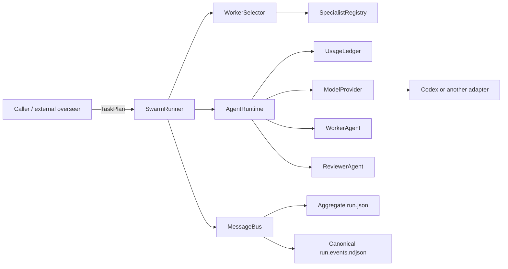

# Architecture

Agent Swarm Framework separates deterministic orchestration from provider-led
generation. The caller may remain the top-level overseer by supplying a typed
plan, while the runtime chooses the eligible profile with the lowest configured
`cost_rank` for each task.

## Component boundaries

- `agent_swarm/swarm_runner.py` owns plan execution, dependency scheduling,
  workspace leases, review policy, and final run status.
- `agent_swarm/agents/` defines typed object agents. Deterministic methods have
  normal bodies; provider-generated methods use `@generation` and typed return
  annotations.
- `agent_swarm/core/runtime.py` owns provider admission, retries, typed response
  validation, usage reconciliation, and invocation records.
- `agent_swarm/core/routing.py` filters role, capability, exact access, and
  quality before applying the `cost_rank` preference.
- `agent_swarm/providers/` contains provider adapters. Agents never launch
  subprocesses directly.
- `agent_swarm/core/bus.py` is the canonical explicit agent-to-agent chronology.
  Conversation maps are projections of that history, not separate sources of
  truth.

## Run lifecycle

1. The caller sends a goal and, preferably, a validated `TaskPlan`.
2. Without a supplied plan, the configured planning agent makes one provider
   call under a read lease.
3. The selector resolves task capabilities and chooses the eligible profile
   with the lowest configured `cost_rank` after safety and quality constraints.
4. Dependency-ready read-only tasks may run concurrently. Workspace writers and
   their reviewers hold an exclusive lease for the checkout.
5. Every generated value is validated against its Pydantic return contract.
6. Workspace writes and configured high-risk reads receive an independent,
   fail-closed review.
7. The runner returns a typed aggregate snapshot and the chronological event
   sequence. Persistence is always explicit.
8. In explicit local ephemeral mode, the CLI captures the aggregate record,
   canonical NDJSON, a binary workspace patch, and a digest manifest before it
   removes the worktree it created.

## Event and artifact model

`run.json` is a self-contained snapshot for inspection and archival. It includes
the plan, task records, routing decisions, invocation usage, optional embedded
bus history, and derived conversation views.

`run.events.ndjson` is the canonical line-oriented, post-run event export. Each
line is one ordered `BusEvent` with `sequence`, `timestamp`, `topic`, `message`,
and delivery outcomes. Message envelopes carry run/task correlation and
causation IDs. The export intentionally excludes provider reasoning and raw
provider events.

Both files are written by atomic replacement. An interrupted write leaves the
previous target intact rather than a partial JSON document or NDJSON line.

Local ephemeral mode extends this pair with `workspace.patch` and
`manifest.json`. The patch captures tracked changes relative to the starting
commit plus non-ignored untracked files, including binary and empty files. The
manifest is written last as the completeness marker and binds each artifact
digest to its base commit and run ID. Cleanup is deliberately ordered after
artifact completion; an unexpected execution or persistence failure retains the
managed path for recovery.

Git repository and difftool variables inherited from a parent hook or editor
are removed from managed Git commands and provider subprocesses. Checkout
selection comes from explicit cwd/arguments; intentional authentication such as
`GIT_SSH_COMMAND` is preserved.

## Budget semantics

The ledger atomically reserves estimated tokens and configured cost before each
provider call. It reconciles provider-reported usage afterward and prevents new
admissions once a limit is reached.

CLI adapters cannot enforce a hard token or dollar ceiling inside a single
agentic call. A provider can therefore report an overage after work completed.
The run becomes `budget_exhausted`, but its successful task output and invocation
evidence remain available. The default concurrency is one so an uncalibrated
provider trips the admission gate before additional tasks start.

`cost_rank` is only an ordering hint among otherwise eligible profiles. It is
not a currency amount. Strict USD admission requires configured, versioned
pricing for every routed provider.

## Extension points

- Implement `ModelProvider` for another runtime and normalize its output and
  usage without changing agents.
- Add `AgentProfile` entries for models or specialist capabilities; routing is
  data-driven.
- Use `SpecialistRouter` and an explicit `ApprovalPolicy` when an external
  application needs a bounded, fail-closed specialist selection step.
- Supply a `TaskPlan` from an API, IDE, or another overseer to avoid a duplicate
  planning call.

## Known boundaries

- The message bus is in-process; durable queues and distributed leases are out
  of scope.
- Workspace exclusion is process-local. Multiple framework processes need
  separate worktrees or an external lock.
- `--local-artifacts-dir` owns one temporary worktree for one CLI run. It does
  not discover or delete pre-existing worktrees, and intentionally excludes
  ignored caches, build products, virtual environments, and credentials from
  its source patch.
- CLI stdout and stderr are currently captured before diagnostics are bounded.
- A version probe confirms the provider executable, not model entitlement or
  compatibility. Validate configured model IDs with the installed provider CLI
  before a costly run.
